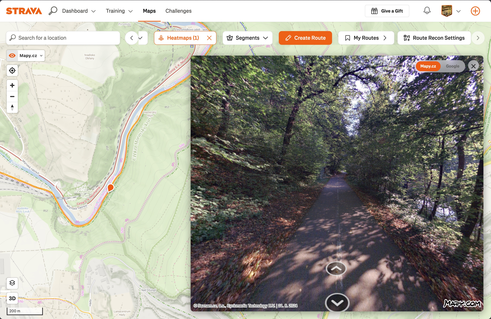
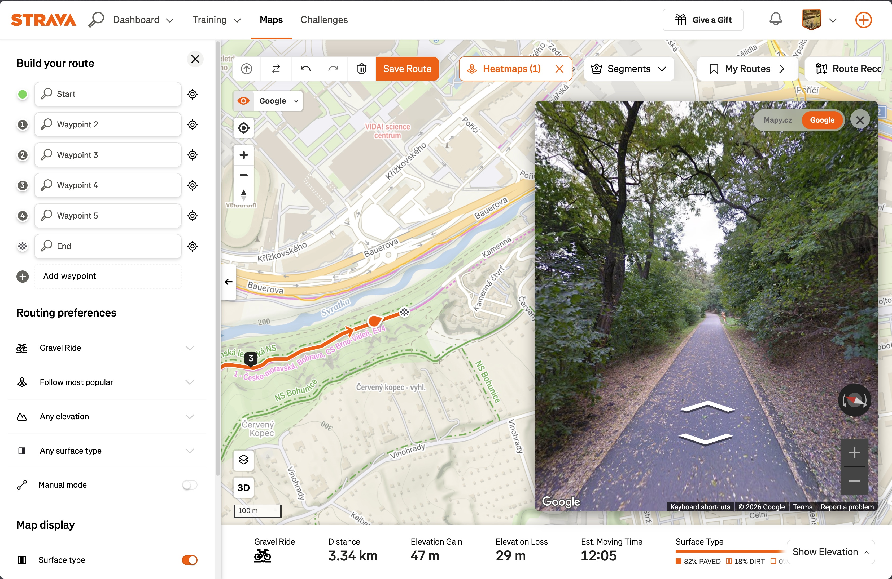
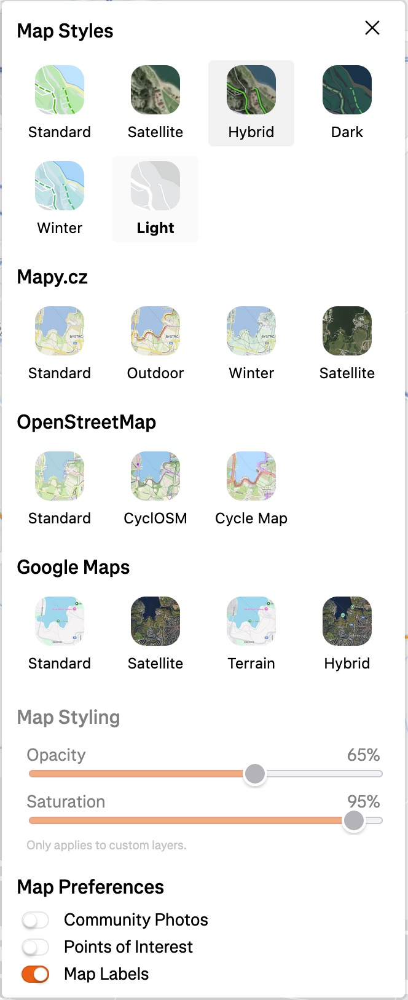

# &ensp;More Maps for Strava

A browser extension that adds additional map layers and a panorama mode to Strava's route builder.

<p align="center">
  <a href="https://chromewebstore.google.com/detail/more-maps-for-strava/adpgjdeigiekdjnjionhhblgfpmkionl">
    
  </a>
  &nbsp;
  <a href="https://addons.mozilla.org/en-US/firefox/addon/more-maps-for-strava/">
    
  </a>
</p>

## Screenshots

<table align="center">
  <tr>
    <td align="center"></td>
    <td align="center"></td>
    <td align="center"></td>
  </tr>
  <tr>
    <td align="center"><sub>Heatmap with Mapy.cz Outdoor and Panorama</sub></td>
    <td align="center"><sub>Route Builder with Google Streetview</sub></td>
    <td align="center"><sub>Available Map Layers</sub></td>
  </tr>
</table>

## Features

### 🗺️ Additional Map Layers

Enhance your route planning with map layers from multiple providers:

- **Mapy.cz** - Standard, Outdoor, Winter, and Satellite views
- **OpenStreetMap** - Standard, CyclOSM, and Thunderforest Cycle Map
- **Google Maps** - Standard, Satellite, Terrain, and Hybrid views

### 👁️ Panorama Mode

Click anywhere on the map to view street-level imagery:

- **Mapy.cz Panorama** - Local coverage in Czech Republic
- **Google Street View** - Global coverage

Switch between providers with the control in the panorama window. Press **`P`** to toggle panorama mode on/off.

### 🎨 Map Styling Controls

Fine-tune your map appearance:

- **Opacity** - Adjust the transparency of custom map layers
- **Saturation** - Control the color saturation from grayscale to full color

## Installation

### Chrome / Edge

<a href="https://chromewebstore.google.com/detail/more-maps-for-strava/adpgjdeigiekdjnjionhhblgfpmkionl">
  
</a>

### Firefox

<a href="https://addons.mozilla.org/en-US/firefox/addon/more-maps-for-strava/">
  
</a>

### Manual

<details>
<summary>Load unpacked from a release</summary>

#### Firefox

1. Download the latest release
2. Navigate to `about:debugging#/runtime/this-firefox`
3. Click "Load Temporary Add-on" and select the `manifest.json` file

#### Chrome / Edge

1. Download the latest release
2. Navigate to `chrome://extensions` (or `edge://extensions`)
3. Enable "Developer mode"
4. Click "Load unpacked" and select the extension folder

</details>

## Configuration

### API Keys

To keep this extension free, each user provides their own API keys. Providers charge per request, so the key needs to be linked to your account. The free tiers are generous — **no credit card required**, and **personal use won't cost you anything**.

Click the **More Maps Settings** button in Strava's map layer menu to enter your keys.

> **Privacy note**: API keys are stored exclusively in your browser's local storage and never leave your machine.

#### Mapy.cz (~1 min)

Required for: Mapy.cz map layers and Mapy.cz Panorama.

1. Go to [developer.mapy.com/account/projects](https://developer.mapy.com/account/projects)
2. Create a free account and a new project
3. Copy the API key and paste it into the extension settings

#### Google Maps (~3 min)

Required for: Google map layers (Standard, Satellite, Terrain, Hybrid) and Google Street View.

1. Go to [Google Cloud Console](https://console.cloud.google.com/google/maps-apis/credentials)
2. Create a free account and a new project
3. Enable the **Map Tiles API** and the **Street View Static API** for your project
4. Create an API key, copy it, and paste it into the extension settings

#### Thunderforest (~1 min)

Required for: Thunderforest Cycle Map layer.

1. Go to [manage.thunderforest.com](https://manage.thunderforest.com/)
2. Create a free account
3. Copy the API key and paste it into the extension settings

### Panorama Provider

Switch between Mapy.cz and Google Street View:
- Use the control in the panorama window
- Or use the dropdown next to the panorama toggle button on the map

## Usage

1. Open [Strava Heatmap](https://www.strava.com/maps) or the [Route Builder](https://www.strava.com/maps/create)
2. Click the map layer menu to see additional options
3. To enable panorama mode, click the eye icon or press **`P`**
4. Click anywhere on the map to view street-level imagery

## Development

```bash
npm install
npm run build   # copies sources to dist/
npm run zip     # builds dist/ and packages into moremaps.zip
```

Releases are automated via GitHub Actions — pushing a `vX.Y.Z` tag builds and publishes to both stores. See [CLAUDE.md](CLAUDE.md) for full development and release workflow.

## License

MIT License - see [LICENSE](LICENSE) for details.

Copyright (c) 2026 Matyáš Strelec
